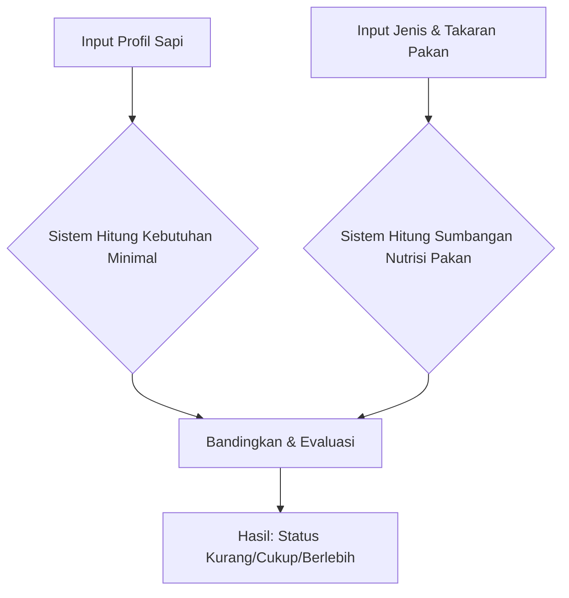

# DipoFeed

DipoFeed adalah aplikasi berbasis seluler (Mobile App) yang dibangun menggunakan Flutter. Aplikasi ini dirancang untuk membantu peternak sapi perah atau ahli nutrisi hewan dalam menghitung, memformulasi, dan mengevaluasi ransum (pakan) sapi secara tepat berdasarkan profil sapi dan kandungan nutrisi bahan pakan. Fokus utama aplikasi adalah pada evaluasi kandungan nutrisi seperti Bahan Kering (BK), Protein Kasar, Total Digestible Nutrients (TDN), dan Energi Metabolisme (ME).

---

## 🛠️ Sistem dan Teknologi

- **Sistem Operasi**: Cross-platform (Dapat dikompilasi ke Android / iOS / Web)
- **Framework Utama**: Flutter (Dart)
- **Arsitektur Data**: Menggunakan pendekatan manipulasi state lokal melalui berbagai layar simulasi. Logic perhitungan dipisah ke dalam modul independen seperti class `PerhitunganKecukupanPakan` dan `PerhitunganFormulasi`.

---

## 📱 Penjelasan Fitur dan Alur Kerja

Aplikasi DipoFeed memiliki 4 fitur utama. Berikut adalah penjelasan konsep, masukan (input), keluaran (output), beserta ilustrasi alur kerjanya:

### 1. Cek Kecukupan Pakan
**Deskripsi:** evaluasi kecukupan nutrien pada pemberian pakan ternak. Fitur ini berfungsi untuk mengevaluasi apakah satu porsi pakan spesifik yang biasa diberikan peternak sudah memenuhi standar kebutuhan gizi seekor sapi atau belum.

**Logika & Alur Kerja:**
Sistem memecah proses menjadi dua jalur: mengkalkulasi **"Apa yang dibutuhkan sapi"** dan **"Apa yang diberikan oleh pakan"**. Keduanya lalu diadu untuk mencari selisihnya (kurang/Cukup/Berlebih).

- **📝 Input:**
  1. **Profil Sapi:** Berat Badan, Produksi Susu (liter), % Lemak Susu, Fisiologi (Dara/Laktasi/Kering Kandang).
  2. **Pemberian Pakan:** Daftar bahan pakan beserta berat basahnya (kg).
- **📤 Output:**
  Tabel rincian evaluasi Nutrisi (BK, Protein, TDN, Ca, P). Jika asupan pakan lebih rendah dari kebutuhan sapi, statusnya merah (**Kurang**).

### 2. Rekomendasi Pakan
**Deskripsi:** Rekomendasi pemberian pakan untuk mencukupi kebutuhan nutrisi ternak. Sistem akan mencari kombinasi terbaik dari bahan pakan yang dimiliki peternak.

**Logika & Alur Kerja:**
Sistem menghitung kebutuhan sapi, lalu melakukan pencarian kombinasi pakan (Trial and Error) untuk memenuhi target Bahan Kering (60% Hijauan, 40% Konsentrat) dan target nutrien lainnya.

- **📝 Input:**
  1. **Profil Sapi** (Sama seperti fitur sebelumnya).
  2. **Bahan yang Dimiliki:** Daftar hijauan dan konsentrat yang tersedia di kandang.
- **📤 Output:**
  Rekomendasi jumlah pemberian (kg) untuk setiap bahan pakan agar kebutuhan nutrien sapi terpenuhi secara optimal.

### 3. Cek Kandungan Pakan
**Deskripsi:** Cek kandungan nutrisi pada pakan. Memungkinkan peternak mensimulasikan "mencampur" berbagai macam bahan pakan dengan takaran berbeda-beda, lalu mengevaluasi kandungan gizi totalnya.

- **📝 Input:**
  **Keranjang Pakan:** *List* atau daftar berbagai macam bahan pakan beserta berat masing-masing (kg).
- **📤 Output:**
  1. **Total Nutrisi Keseluruhan:** Akumulasi BK, Protein, TDN, dan ME dari *seluruh* pakan.
  2. **Analisis Biaya:** Estimasi total biaya campuran pakan.

### 4. Database Pakan
**Deskripsi:** Database bahan pakan. Fitur referensi yang bertindak sebagai ensiklopedia mini untuk melihat profil nutrisi dari berbagai bahan pakan lokal.
- **Konsep:** Pengguna dapat mencari, melihat, menambah, atau mengubah komposisi zat gizi dari berbagai bahan pakan.
- **📝 Input:** Nama bahan pakan, Kategori, Kandungan Nutrisi (BK, PK, TDN, Harga, dll).
- **📤 Output:** Katalog profil nutrisi pakan lokal yang digunakan sebagai basis perhitungan di seluruh fitur aplikasi.

---

## 🧮 Detail Perhitungan (Referensi Teknis)
*Bagian ini memuat detail matematis di balik layar yang digunakan sistem untuk mengeksekusi fitur-fitur di atas. Seluruh perhitungan distandarisasi menggunakan basis **Bahan Kering (BK)**.*

### A. Rumus Kebutuhan Nutrisi Sapi
Untuk mengevaluasi pakan, sistem menghitung angka baku minimal yang dibutuhkan sapi berdasarkan kondisi fisiologisnya:

| Komponen Gizi | Rumus / Estimasi Sistem |
| :--- | :--- |
| **Kebutuhan BK** | `((2.0% s/d 4.0% berdasarkan Laktasi) / 100) * Berat Badan` |
| **Kebutuhan Protein** | `12% * Kebutuhan BK` |
| **Kebutuhan TDN** | `65% * Kebutuhan BK` |
| **Kebutuhan ME** | `(0.11 * B.Badan) + (Kandungan Susu * 7.5) + Tambahan Bunting` |

*(Catatan: Tambahan energi bunting diberikan bila usia kehamilan mencapai atau lebih dari 6 bulan: berturut-turut +6, +8, +15, dan +27 MCal per bulannya).*

### B. Rumus Konversi Sumbangan Pakan (As-Fed ke Nutrisi Aktual)
Karena takaran pakan dari petani biasanya basah (*as-fed*), sistem mengonversinya ke bobot murni (Bahan Kering) terlebih dahulu sebelum menghitung protein dan energinya:

| Komponen Terkalkulasi | Rumus Konversi |
| :--- | :--- |
| **Bahan Kering (BK) Aktual** | `(% BK Pakan / 100) * Takaran Pakan Segar (kg)` |
| **Sumbangan Protein** | `(% Protein Pakan / 100) * BK Aktual (kg)` |
| **Sumbangan TDN** | `(% TDN Pakan / 100) * BK Aktual (kg)` |
| **Sumbangan ME** | `Batas ME Pakan * BK Aktual (kg)` |

### C. Logika Evaluasi & Penentuan Status
Angka Asupan dari Pakan (Bagian B) dikurangi Angka Kebutuhan Sapi (Bagian A).
- **Rumus:** `Selisih = Total Asupan Pakan - Total Kebutuhan Sapi`
- Ambang Toleransi (Threshold): `+/- 0.0001`
- **Kurang**: Jika selisih bernilai negatif (Asupan < Kebutuhan).
- **Cukup**: Jika asupan tepat dan seimbang.
- **Berlebih**: Jika selisih bernilai positif (Asupan > Kebutuhan).

### D. Rasio Hijauan dan Konsentrat
Setiap pakan memiliki label kategori spesifik. Sistem mengklasifikasikan pakan bertipe *Hijauan* dan *Limbah* ke dalam satu wadah Hijauan, sisanya sebagai Konsentrat.
- **Rumus Persentase**: `(Total BK Kategori / Total Keseluruhan BK Semua Pakan) * 100%`
